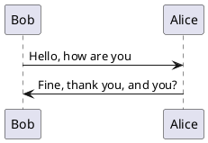

##

- C语言编程魔法书：基于C11标准

<!--more-->

## 电影

### 未看

- 越哥说电影
  - 黑炮事件
  - 乌龟也会飞: 伊拉克,美伊战争
  - 牧马人: 特殊时期,被批判的人遇到善良的爱人.

教父三部曲

香火

勇敢的心

### 已看

- 夜色人生
禁酒令是黑帮斗争,爱尔兰人;
- 控方证人
犯罪悬疑,1958年的英国谋杀案电影
- 小岛惊魂
惊悚悬疑,为什么杀了两个孩子?战争?


!theme spacelab
Bob -> Alice :  hello
Bob <- Alice :  $success("success: hello B.")
Bob -x Alice :  $failure("failure")
Bob ->> Alice : $warning("warning")



  Alice -> Bob: Authentication Request
  Bob --> Alice: Authentication Response

  Alice -> Bob: Another atuhentication Request
  Alice <-- Bob: Another authentication Response
