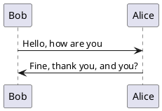

##

- C语言编程魔法书：基于C11标准

<!--more-->


!theme spacelab
Bob -> Alice :  hello
Bob <- Alice :  $success("success: hello B.")
Bob -x Alice :  $failure("failure")
Bob ->> Alice : $warning("warning")



  Alice -> Bob: Authentication Request
  Bob --> Alice: Authentication Response

  Alice -> Bob: Another atuhentication Request
  Alice <-- Bob: Another authentication Response
