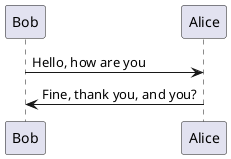

## 书

### 
- 豆豆三部曲
背叛
遥远的救世主
天幕红尘

- 在细雨中呼唤 余华
### computer
- C语言编程魔法书：基于C11标准
- 剑指offer 名企面试官精讲典型编程题
- C Primer Plus(第六版)
- C语言解惑：指针、数组、函数和文件
回看第七章
- 算法图解
- 大话数据结构
- 软件故事

ACM http://www.acm.org
IEEE http://www.computer.org
USENIC http://www.usenix.org

<!--more-->

### 软件故事

1946年 ENIAC

批处理系统
硬件发展-》 分时系统
机器语言--纸带
汇编语言-- 指令 操作
Fortran语言 - 第一种高级计算机语言
COBOL 语言
BASIC

<!--more-->

卡耐基 -- 人工智能

IBM 701  704(Fortran商用)
IBM OS/360

存储时计算机

Unix
c 语言

欧洲计算机技术：
linux 芬兰
万维网 瑞典

APPLE II
Macish

微软
收购DOS  
windows BASIC

鼠标、
显示器

C++

Java 
Java与互联网

阿帕奇
IBM linux

### 硅谷百年

硅谷 
斯坦福、伯克利、圣何塞大学

特曼

真空管、晶体管、集成电路
仙童半导体 - 八叛徒
英特尔、AMD、英伟达

### 遥远的救世主

神级道，道法自然，如来。

规律不以人的意志转移

## 电影

### 未看

- 越哥说电影
  - 黑炮事件
  - 乌龟也会飞: 伊拉克,美伊战争
  - 牧马人: 改编自张贤亮的小说<令与肉>特殊时期,被批判的人遇到善良的爱人.汗水浸过的土地,相濡以沫的.传统女性,自信,高贵.
  - 最爱 : 章子怡(琴琴),郭富城(得意);卖血,艾滋病村,艾滋病人的人生,爱情.贫穷,人性,善良,荒凉.
  - 香火   求,乞,骗

教父三部曲

勇敢的心

### 已看

- 夜色人生
禁酒令是黑帮斗争,爱尔兰人;
- 控方证人
犯罪悬疑,1958年的英国谋杀案电影
- 小岛惊魂
惊悚悬疑,为什么杀了两个孩子?战争?
- 千钧一发 1997年
基因筛选,基因歧视,依靠基因来判定一个人,文生借用优等基因人的身份,入选土卫十四飞行员.
- 致命ID
多重人格


!theme spacelab
Bob -> Alice :  hello
Bob <- Alice :  $success("success: hello B.")
Bob -x Alice :  $failure("failure")
Bob ->> Alice : $warning("warning")



  Alice -> Bob: Authentication Request
  Bob --> Alice: Authentication Response

  Alice -> Bob: Another atuhentication Request
  Alice <-- Bob: Another authentication Response


